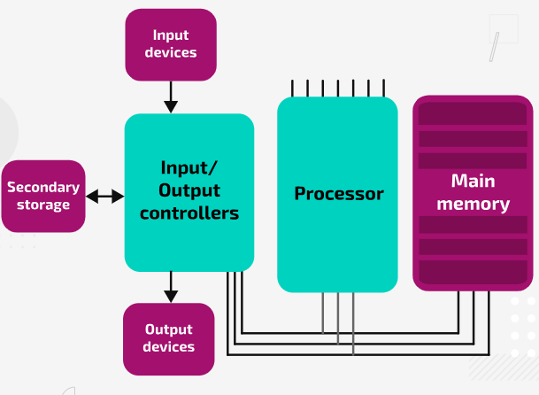

## Common System Architectures
  
### Brief History of system architecture

#### The stored program concept

Since previous machines could only compute one singular problem/calculation, computer systems introduced a **memory unit** that could store data as well as programs. It allowed for instructions to be fetched from the memory unit and executed, one after the other, by a processing unit that was designed to perform arithmetic and logical operations. This made machine more **versatile** 

----------
  
### Von Neumann Architecture

Used the idea of **storing program instructions and data** in **main memory** and moving them between memory and the processor when they were needed by the processor

**Consists of:**
- Processor
- Memory unit that can communicate directly with the processor
- Connections for input and output devices
- Secondary storage for saving/backing up data

  

The processor accesses the instructions and data by connections called **buses:**

- **Address bus** is used to identify the addresses location
- **Data bus** is used to transfer the contents to/from that location

This means **the same address and data buses** are used in the process of transferring instructions and data between the components

A third bus, **Control Bus**, is used to synchronise and control operations

| Aspect        | Description                                                                 |
|---------------|-----------------------------------------------------------------------------|
| Advantages    | • Simple design using one memory and bus • Cheaper to implement • Flexible memory usage |
| Disadvantages | • Von Neumann bottleneck limits performance • Data and instructions share buses, slowing execution • Potential security risks |

----------

### Harvard Architecture

This architecture keeps instructions and data in **separate memories**. The processor accesses these memories **using separate data and address buses**. 

This architecture is used extensively in embedded systems.

  

| Aspect        | Description                                                                 |
|---------------|-----------------------------------------------------------------------------|
| Advantages    | • Faster execution due to separate data and instruction buses • No Von Neumann bottleneck • Improved security |
| Disadvantages | • More complex hardware design • More expensive to implement • Less flexible memory allocation |

### Comparison

**Harvard Architecture** uses separate memory units and buses which means both memories can be accessed simultaneously. This minimises the issue of keeping the processor waiting while loading or saving data into memory, **which in turn increases the processor performance**. *Harvard Architecture* separates instruction and data memories, allowing each to be optimised independently in size, word length, or technology, which improves speed and security. For instance, instruction memory can be implemented as read-only memory (ROM) in embedded systems to prevent accidental modification or hacking. This separation makes Harvard architecture well suited to embedded systems, such as traffic-control cameras, that perform predefined tasks and require fast, real-time data processing.

**Von Neumann Architecture** uses the same address and data buses for both instructions and data, which means that both share the same pathway. *Von Neumann Architecture* stores instructions and data in the same memory, offering greater flexibility for running a wide range of programs but also introducing security risks, as malicious instructions can be disguised as data. As a result, von Neumann architecture is typically used in general-purpose computers that must support diverse applications and multitasking.

