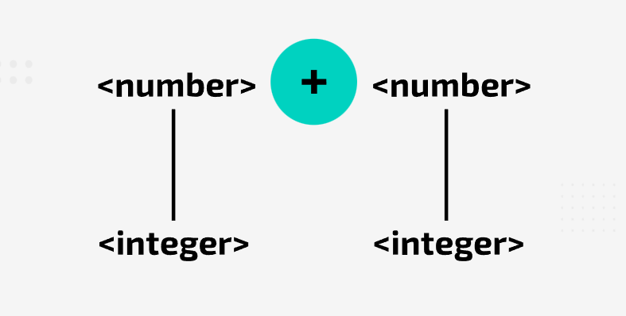
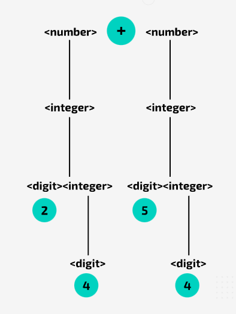
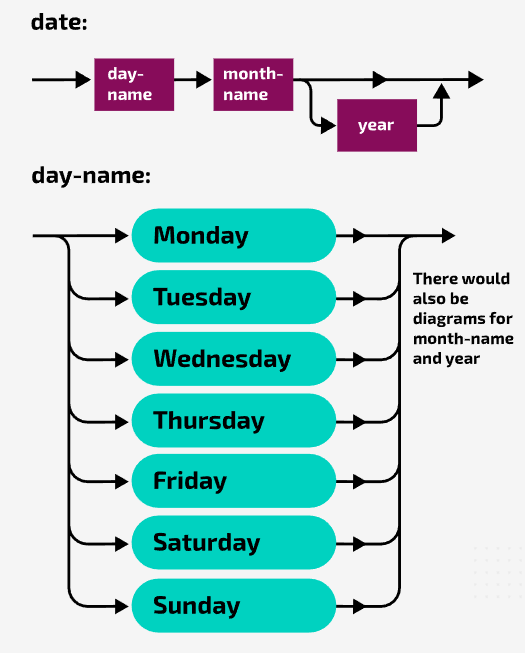

### Context-free Languages
**Backus–Naur Form can be defined as a context-free grammar**. Most programming languages can be defined as context-free languages and context-free languages are more complex than regular languages.
To define the set of strings in a particular context free language, use **context-free grammar: a set of production rules that describe all possible strings in a given language**.
  
  
### Backus-Naur Form

BNF (Backus–Naur Form) is a context-free grammar commonly used by developers of programming languages to specify the syntax rules of a language.

BNF uses a range of symbols and expressions to create **production rules**. A simple BNF production rule might look like this:

`<digit>::= 0|1|2|3|4|5|6|7|8|9`

This would be interpreted as: A digit can be defined as 0, 1, 2, 3, 4, 5, 6, 7, 8 or 9

The chevrons (< >) are used to denote a non-terminal symbol. If a **non-terminal symbol** appears on the right side of the production rules, it means that there will be another production rule (or set of rules) to define its replacement. Consider the following production rule:

`<fullname>::=<title><name><name>`

This shows that **full name** comprises a **title**, a **name** and another **name**. However, all three component parts are non-terminal. Therefore, further production rules are required. For example a production rule may define **title** as follows:

`<title></title>:= Mr|Mrs|Ms|Miss|Dr`

In this rule, these titles are terminal symbols. They're not enclosed in chevrons so they are the actual values that are allowed for **title**.

Whenever you find a non-terminal symbol on the right side of a production rule, there should be another rule that has the symbol on the left side. This continues until everything can be specified in relation to terminal symbols.

Here is a complete set of rules:

`<addition>::= <number>+<number>`

`<number>::= <sign><integer>|<integer>`

`integer::= <digit>|<digit><integer>`

`<digit::= 0|1|2|3|4|5|6|7|8|9`

`<sign>::= +|-`
  
  
### Recursion in BNF production rules

Recursion is used in BNF to write production rules to define 'one or more' of a symbol.

For example a number can be made up of one or more digits. You may start out by writing a regular production rule:

`<number>::= <digit>|<digit><digit>|<digit><digit><digit>|...`

But where would you stop? How many digits can a number have? **Recursion allows for an elegant solution**:

`<number>::= <digit>|<digit><number>`

`<digit>::= 0|1|2|3|4|5|6|7|8|9`

Now you can see that the production rules to ask if the following sets of digits are numbers: 2, 16, 234
  
  
### Parse Tree

Parse trees can be very useful to check whether a string satisfies a production rule.

Parsing means to break something down to its component parts. Consider the set of production rules that were examined earlier:

`<addition>::= <number>+<number>`

`<number>::= <sign><integer>|<integer>`

`integer::= <digit>|<digit><integer>`

`<digit::= 0|1|2|3|4|5|6|7|8|9`

`<sign>::= +|-`
  

#### Step 1

Put the production rule for addition at the top of the tree. It includes a terminal + symbol. This is fine, the string you are checking includes this symbol — so far, so good! Highlight the + symbol in your tree.

  

#### Step 2

To be a valid addition, the string either side of the + symbol must satisfy the production rule:

`<number>::= <sign><integer>|<integer>`

This means that you must have a **sign** followed by an **integer**, or just an **integer**.

Well, neither 24 or 54 start with a sign. So, to be valid, the addition needs to satisfy the production rule for **integet**, so you can put **<integer>** below **<number>** on either side of the tree.

  

#### Step 3

Now that 24 is an **integer**.

The production rule  for integer is:

`<integer>::= <digit>|<digit><integer>`

24 is not a **digit** (as digits are just single numeric values/symbols). Therefore, to be valid, 24 must be a **digit** followed by an integer. 

Put **<digit><integer>** on the next line of the parse tree. You can do this on both sides, as 54 will be treated similarly.

  

#### Step 4

Consider 24 again. Is it a **digit** followed by an **integer**?
Well ,2 is definitely a **digit**, so write 2 below **<digit>**
Similarly, you can write 5 below **<digit>** on the right side of the tree. Highlight 2 and 5.

  

#### Step 5

Now show that 4 is an **integer** (on both sides). The production rule for **integer** is:

`<integer>::= <digit>|<digit><integer>`

Well, 4 is a **digit** so write **<digit>** below **<integer>** and 4 below **<digit>**. You can do this on the other side as well. Highlight both digits.

And that's how you prove, using a parse tree, that 24+54 is a valid **addition**

  
  

### Syntax Diagrams

In the absence of a key, you must be able to recognise terminal and non-terminal symbols

`<special>::= @ | ? | & | *`

**Syntax Diagram**

The alternatives are stacked and can picked as you follow the line through the diagram from beginning to enclosed

A more complex rule would look like this:

`<date>::= <day-name><month-name>|<day-name><month-name><year>`

**Syntax Diagram**

  

Syntax diagrams are always read from left to right, following the arrows. You cannot go back on yourself unless the arrows allow it. Recursion is dealt with by allowing a loop back through the diagram.

So the rule `<number>::= <digit>|<digit><number>` would be represented by:

  
  

### BNF and Regular Expressions

Since all regular languages are context-free, you can convert every regular expression to a BNF production rule (or set of rules). However the reverse is not true.

When we write expressions with parenthesis like (a + (b * c)) — every open parenthesis ( must have a matching close parenthesis ) later on.

A finite state machine (FSM) is a kind of computer model that can only be in one of a limited number of states at a time. It doesn’t have memory, it can only “remember” where it is right now.

If you wanted an FSM to check for balanced parentheses, it would need to “remember” how many parentheses it has seen so far and hasn’t closed yet. That means it would need:

- One state for 0 open parentheses,

- One state for 1 open parenthesis,

- One state for 2 open parentheses, and so on.

But since there could be any number of open parentheses (no limit), the FSM would need infinite states — which it can’t have, because it’s finite.

So we need something more powerful, something like a context-free grammar (or context-free language) which can handle things that involve matching pairs or nested structures of unlimited depth, like balanced parentheses.

In short:

- FSMs can’t keep track of how many parentheses are open.

- Context-free languages can — so we use them for describing things like balanced parentheses in programming languages.
