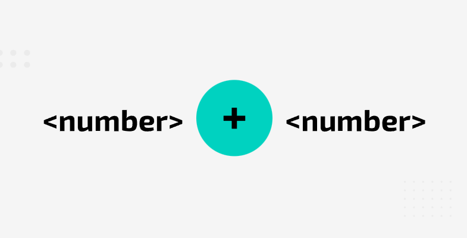

### Context-free Languages
**Backus–Naur Form can be defined as a context-free grammar**. Most programming languages can be defined as context-free languages and context-free languages are more complex than regular languages.
To define the set of strings in a particular context free language, use **context-free grammar: a set of production rules that describe all possible strings in a given language**.
  
  
### Backus-Naur Form

BNF (Backus–Naur Form) is a context-free grammar commonly used by developers of programming languages to specify the syntax rules of a language.

BNF uses a range of symbols and expressions to create **production rules**. A simple BNF production rule might look like this:

`<digit>::= 0|1|2|3|4|5|6|7|8|9`

This would be interpreted as: A digit can be defined as 0, 1, 2, 3, 4, 5, 6, 7, 8 or 9

The chevorns (< >) are used to denote a non-terminal symbol. If a **non-terminal symbol** appears on the right side of the production rules, it means that there will be another production rule (or set of rules) to define its replacement. Consider the following production rule:

`<fullname>::=<title><name><name>`

This shoes that **full name** comprises a **title**, a **name** and another **name**. However, all three component parts are non-terminal. Therefore, further production rules are required. For example a production rule may define **title** as follows:

`<title></title>:= Mr|Mrs|Ms|Miss|Dr`

In this rule, these titles are terminal symbols. Theyre not enclosed in chevrons so they are the actual values that are allowed for **title**.

Whenever you find a non-terminal symbol on the right side of a production rule, there should be another rule that has the symbol on the left side. This continues until everything can be specified in relation to terminal symbols.

Here is a complete set of rules:

`<addition>::= <number>+<number>`

`<number>::= <sign><integer>|<integer>`

`integer::= <digit>|<digit><integer>`

`<digit::= 0|1|2|3|4|5|6|7|8|9`

`<sign>::= +|-`
  
  
### Recursion in BNF production rules

Recursion is used in BNF to write production rules to define 'one or more' of a symbol.

For example a number can be made up of one or more digits. You may start out by writing a regular production rule:

`<number>::= <digit>|<digit><digit>|<digit><digit><digit>|...`

But where would you stop? How many digits can a number have? **Recursion allows for an elegant solution**:

`<number>::= <digit>|<digit><number>`

`<digit>::= 0|1|2|3|4|5|6|7|8|9`

Now you can see that the prod rules to ask if the following sets of digits are numbers: 2, 16, 234
  
  
### Parse three

Parse trees can be very useful to check whether a string satisfies a production rule.

Parsing means to break something down to its component parts. Consider the set of production rules that were examined earlier:

`<addition>::= <number>+<number>`

`<number>::= <sign><integer>|<integer>`

`integer::= <digit>|<digit><integer>`

`<digit::= 0|1|2|3|4|5|6|7|8|9`

`<sign>::= +|-`
  

Step 1. Put the production rule for addition at the top of the tree. It includes a terminal + symbol. This is fine, the string you are checking includes this symbol — so far, so good! Highlight the + symbol in your tree.

