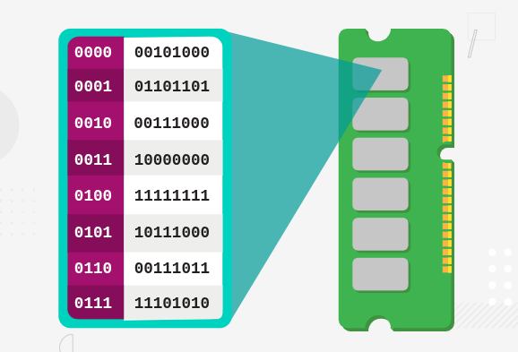
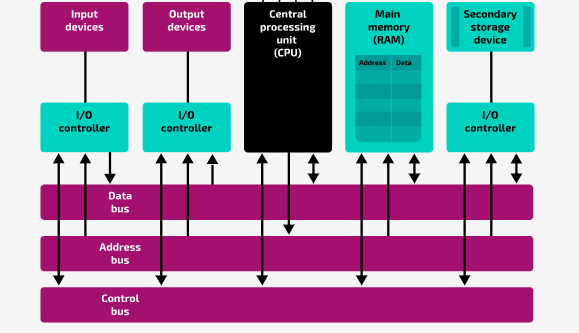

## Components of a Computer System

The main internal components of a computer system are:

- Processor (CPU)
- Main Memory
- Input/Output (i/o) controllers
  
#### The Processor

This is also sometimes referred to as the CPU (**Central Processing Unit**)

The processor is the part of the computer system that processes data by **executing program instructions**

Each processor is designed to carry out a specific set of operations and will have a defined instructions set

For the processor to be ale to execute a program the instructions must first be transferred from secondary storage >> main memory from they're **fetched, decoded and executed**.
  
#### Main Memory

This is the memory which can be accessed directly by the processor

Each **memory location** has a **unique** physical **address**

  

There are two main types of main memory:

- Random Access Memory (RAM), which is used to provide **working memory** that is read from and written by the processor during the *fetch, decode, execute cycle*
- Read Only Memory (ROM), which is used to store information used during the boot sequence when the computer system is first powered on

----------

#### Buses

| **Bus** | **Purpose** |
| -------------- | --------------- |
| Address | Carries address locations of stored data from the processor to main memory and input/output controllers |
| Data | Carries data to and from the processor, main memory, and input/output controllers |
| Control | Carries signals that coordinate the operation of the components |

These three buses together are known as the **system bus**
  

  

#### I/O Controllers

All external devices are connected to the processor through I/O Controllers.

Secondary storage devices are also connected to the processor through I/O controllers. Secondary storage, in contrast to main memory, cannot be accessed directly by the processor.

An I/O controller can be described as an interface between the core computer system and its peripherals.
  
#### Data Bus

The **data bus** is used to transfer data and instructions. The data bus is **bidirectional**, it allows a two-way connection between internal components of the system allowing values to be written to or read from a location.

- Data is transferred to and from the processor
- Data is transferred to and from main memory
- Data is transferred to and from the I/O controllers
- Instructions are carried from main memory into the processor (to be decoded and executed)

The **width** of the data bus refers to its number of parallel lines. This determines **the number of bits that can be transferred in one operation**. For example, how many bits can be transferred in one go between the memory and the processor. It is typically a multiple of a byte (8, 16, 32, or 64 bits).

- If the width of the data bus is 8 bits, then 8 bits can be transferred at one time
- If the width of the data bus is 16 bits, then 16 bits can be transferred at one time

In general, if the width of the data bus is expressed as n bits, then n bits can be transferred at one time.

The amount of data that can be fetched at one time can affect the performance of a computer system. 
  
#### Address Bus

The **address bus** is used to specify the address of a memory location to either **read** (load) data from or **write** ( store) data to that memory location.

There is a **one-way** connection from the processor to the address bus and a **one-way** connection from the address bus to the main memory and to the I/O controllers. This is because the address bus is a **unidirectional** bus, which allows the processor to establish a connection with an addressable 'unit', whether it's a memory location or an I/O controller.

The **width** of the address bus refers to its number of parallel lines, which determines the number of bits that can be used to form an address of a memory location. It is typically a multiple of a byte (8, 16, 32, or 64 bits).

- If the width of the address bus is 8 bits, then there are ${2^8}$ numbers that can be used to address memory locations
- If the width of the address bus is 16 bits, then there are $2^{16}$ numbers that can be used to address memory locations

In general, if the width of the address bus is expressed as n bits, then there are ${2^n}$ numbers that can be used to address memory locations.

Therefore, the width of the address bus determines the maximum number of addressable memory locations, the **maximum memory capacity of a computer system**. This is called the address space and it can affect processor performance. 
  
#### Control Bus

The control bus is used to send control signals that manage and orchestrate the operations that take place inside a computer system. This includes exchanging status signals between the components of the computer system, and transmitting clock signals required for the coordination of operations. For example, a control signal can be used to:

- Request communication between two units
- Acknowledge a communication request
- Specify the type of data that is being transferred via the other buses (i.e. data values, instructions, or addresses)
- Synchronise the communication between the components using the clock pulses

The control bus is **bidirectional**, there are two-way connections between the components that the control bus connects.

Examples of control signals are:

- **Memory read:** Places data from a specific memory location onto the data bus
- **Bus request:** Signifies that a component needs to access a bus
  
----------

### System Clock

This is an oscilllator that generates a signal used to synchronise the operations of the processor

The time taken between signal changes is called a **clock cycle**. The **speed** of the clock is measured by the number of clock cycles in one second. One clock cycle per second is 1Hz.

