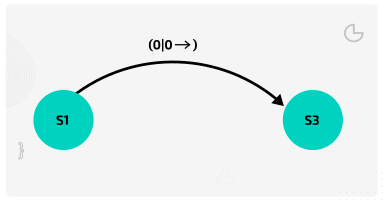
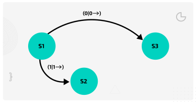

## Turing Machines

### Components of a Turing Machine

There a various necessary components:

- A infinitely long tape divided into squares
- A finite alphabet of symbols, e.g {0,1}, the set of binary digits
- A sensing read/write head: this would be able to look at a square on the tape and read its symbol. In response to what was read, the machine could leave the symbol unchanged, or replace it with another symbol (including erasing the symbol to leave the cell blank). The head would then move left or right one square at a time.
- A finites set of states: one state is the start state and there would be one or more hating states (with no outgoing transitions)
- A set of transition rules: to specify how the machine operates
  

### The transition rules

The rules are expressed in the form of a **transition function**. By convention the Greek letter 'delta' ( δ ) is used to represent the transition function, which is written in the form:

**δ (Current state, input symbol) = (new state, output symbol, movement)**
  
Thus the rule δ (S0, 0) = (S3, 1, <-) would be read as follows:

**IF** the machine is currently in state 0 (S0) **AND** the input symbol is 0, **THEN** the machine will transition to state 3 (S3), write a 1 to the tape and move a cell to the left
  

#### A Turing machine models a single fixed program

A Turing machine can be viewed as a computer with a single fixed program. For each program, a separate machine would be needed. This seems like a strange concept in today's world, but at the time, computing machines were built with the components and architecture to solve just one specific problem. Turing's work proved that computers did not need to be different.

  

#### Relationship between a Turing machine and a modern computer

The memory on the Turing machine is the infinitely long tape. Data is stored and modified by writing to the tape. The transition function provides the program to be executed.
  

### Relationship between transition function and state transition diagram

A Transition Function is a function that determines how a Turing Machine moves from one state to the other, and can be exoressed in a state dtransition diagram.  
  
There is some rules that the turning machine must follow. 
In these rules, the symbol □ is used to represent a blank cell on the tape. The arrows represent movement (left or right) of the read/write head.  

In a state transition diagram, here are what each things repersent:
- a circle (a state)
- an arrow (a transition)
- a label on the arrow showing:
  - input symbol read
  - output symbol written
  - movement (→ or ←)

Formatted like:
input / output , movement
(E.g., `0 / 0 , →`)

Here are an examples of the rules:  

**δ(S1, 0) = (S3, 0, →)**

Start by taking the first rule: δ(S1, 0) = (S3, 0, →). You need to draw the two states and the transition line; remember to label the input, output, and movement on the transition line.

This means if in S1 and it reads 0, then write 0 and move right, go to S3.
  

**δ(S1, 1) = (S2, 1, →)**

Now take the next rule: δ(S1, 1) = (S2, 1, →). You need to add a new state (S2) to the diagram and a transition from S1 to S2. Don’t forget to label it!

This means if in S1 and it reads 1, then write 1 and move right, go to S2.
  

**δ(S1, □) = (S5, □, →)**

Take the next rule: δ(S1, □) = (S5, □, →). You need to add a new state (S5) to the diagram and label the transition from S1 to S5.

This means if in S1 and read blank, then write blank and move right, go to S5.
  

**δ(S2, 0) = (S2, 0, →)**

**δ(S2, 1) = (S3, 1, →)**

**δ(S2, □) = (S4, 0, →)**

**δ(S3, 0) = (S3, 0, →)**

**δ(S3, 1) = (S2, 1, →)**

**δ(S3, □) = (S4, 1, →)**

Continue taking each rule in turn. Label the transitions carefully, until you have completed the diagram.

  

