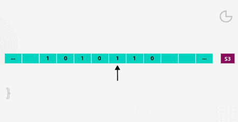
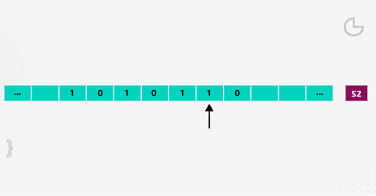
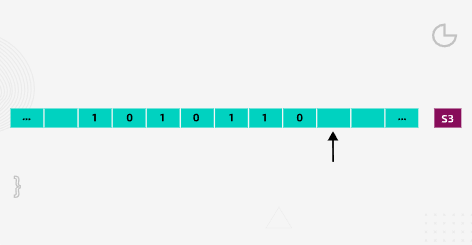

## Turing Machines

### Components of a Turing Machine

There a various necessary components:

- A infinitely long tape divided into squares
- A finite alphabet of symbols, e.g {0,1}, the set of binary digits
- A sensing read/write head: this would be able to look at a square on the tape and read its symbol. In response to what was read, the machine could leave the symbol unchanged, or replace it with another symbol (including erasing the symbol to leave the cell blank). The head would then move left or right one square at a time.
- A finites set of states: one state is the start state and there would be one or more hating states (with no outgoing transitions)
- A set of transition rules: to specify how the machine operates
  
----------

### The transition rules

The rules are expressed in the form of a **transition function**. By convention the Greek letter 'delta' ( δ ) is used to represent the transition function, which is written in the form:

**δ (Current state, input symbol) = (new state, output symbol, movement)**
  
Thus the rule `δ (S0, 0) = (S3, 1, <-)` would be read as follows:

**IF** the machine is currently in state 0 (S0) **AND** the input symbol is 0, **THEN** the machine will transition to state 3 (S3), write a 1 to the tape and move a cell to the left
  

----------

#### A Turing machine models a single fixed program

A Turing machine can be viewed as a computer with a single fixed program. For each program, a separate machine would be needed. This seems like a strange concept in today's world, but at the time, computing machines were built with the components and architecture to solve just one specific problem. Turing's work proved that computers did not need to be different.
  

----------
#### Relationship between a Turing machine and a modern computer

The memory on the Turing machine is the infinitely long tape. Data is stored and modified by writing to the tape. The transition function provides the program to be executed.
  

----------

### Relationship between transition function and state transition diagram

**A Transition Function is a function that determines how a Turing Machine moves from one state to the other, and can be expressed in a state transition diagram.**  
  
There is some rules that the turning machine must follow. 
In these rules, the symbol □ is used to represent a blank cell on the tape. The arrows represent movement (left or right) of the read/write head.  

In a state transition diagram, here are what each things represent:
- a circle (a state)
- an arrow (a transition)
- a label on the arrow showing:
  - input symbol read
  - output symbol written
  - movement (→ or ←)

Formatted like:
input / output , movement
(E.g., `0 / 0 , →`)

  
Here are an examples of the rules:  

`δ(S1, 0) = (S3, 0, →) :`

Start by taking the first rule: **δ(S1, 0) = (S3, 0, →)**. You need to draw the two states and the transition line; remember to label the input, output, and movement on the transition line.

This means if in S1 and it reads 0, then write 0 and move or scan right, switch to state S3.
  

`δ(S1, 1) = (S2, 1, →) :`

Now take the next rule: **δ(S1, 1) = (S2, 1, →)**. You need to add a new state (S2) to the diagram and a transition from S1 to S2. Don’t forget to label it!

This means if in S1 and it reads 1, then write 1 and move or scan right, switch to state S2.
  

`δ(S1, □) = (S5, □, →) :`

Take the next rule: **δ(S1, □) = (S5, □, →)**. You need to add a new state (S5) to the diagram and label the transition from S1 to S5.

This means if in S1 and read blank, then write blank and move or scan right, switch to state S5.
  

Continue taking each rule in turn. Label the transitions carefully, until you have completed the diagram.

`δ(S2, 0) = (S2, 0, →) :`

If in S2 and reads 0, then stay in state S2, write 0(no change) and just keep scanning right(move the head right).

`δ(S2, 1) = (S3, 1, →) :`

If in S2 and reads 1, then write 1, switch to state S3 and keep scanning right.

`δ(S2, □) = (S4, 0, →) :`

At the end of the tape(reads blank), if in S2, then write a 0(on the blank spot) and switch to state S4() and move / scan right.

`δ(S3, 0) = (S3, 0, →) :`

If in S3 and read 0, just keep moving right.(stay at state S3 and write 0)

`δ(S3, 1) = (S2, 1, →) :`

If in S3 and reads 1,then write 1, switch back to S2 and keep scanning right. so S2 ↔ S3 switch every time a 1 is read.

`δ(S3, □) = (S4, 1, →) :`

At the end of the tape, if in S3, append a 1 and switch to state S4.  

As transition that goes to S4 are
- `δ(S2, □) = (S4, 0, →)`
- `δ(S3, □) = (S4, 1, →)`

This only happens when the machine reads blank and there is no rules for S4, which means S4 is a finish state

  

----------

### Tracing Simple Turing Machine

**Tape and current state**

  
#### Tracing the Turing Machines

**Step 1.** Find the rule for the current state (S1), and current input (1)

`δ(S1, 0) = (S3, 0, →)`

`δ(S1, 1) = (S2, 1, →)`

`δ(S1, □) = (S5, □, →)`

`δ(S2, 0) = (S2, 0, →)`

`δ(S2, 1) = (S3, 1, →)`

`δ(S2, □) = (S4, 0, →)`

`(S3, 0) = (S3, 0, →)`

`δ(S3, 1) = (S2, 1, →)`

`δ(S3, □) = (S4, 1, →)`

You need to: transition to S2; write a 1 (no need to do this as it was 1 anyway); and move one cell to the right.

The machine now looks like this:

  
**Step 2.** Find the rule for the current state (S2), and current input (0)

`δ(S2, 0) = (S2, 0, →)`

You need to: stay in S2; write a 0 (no need to do this as it was 0 anyway); and move one cell to the right.

The machine now looks like this:

  
**Step 3.** Find the rule for the current state (S2), and current input (1)

`(S2, 1) = (S3, 1, →)`

You need to: transition to S3; write a 1 (no need to do this as it was 1 anyway); and move one cell to the right.

The machine now looks like this:

  
**Step 4.** Find the rule for the current state (S3), and current input (0)

`δ(S3, 0) = (S3, 0, →)`

You need to: stay in S3; write a 0 (no need to do this as it was 0 anyway); and move one cell to the right.

The machine now looks like this:

  
**Step 5** Find the rule for the current state (S3), and current input (1)

`δ(S3, 1) = (S2, 1, →)`

You need to: transition to S2; write a 1 (no need to do this as it was 1 anyway); and move one cell to the right.

The machine now looks like this:

  
**Step 6.** Find the rule for the current state (S2), and current input (1)

`δ(S2, 1) = (S3, 1, →)`

You need to: transition to S3; write a 1 (no need to do this as it was 1 anyway); and move one cell to the right.

The machine now looks like this:

  
**Step 7.** Find the rule for the current state (S3), and current input (0)

`δ(S3, 0) = (S3, 0, →)`

You need to: stay in S3; write a 0; and move one cell to the right.

The machine now looks like this:

  
**Step 8.** Find the rule for the current state (S3), and current input (□)

`δ(S3, □) = (S4, 1, →)`

You need to: transition to S4; write a 1 and move one cell to the right.

The machine now looks like this:

  

**Step 9** Now you're in the halting state, so the machine stops
  

----------

### The importance of Turning Machines
  
The abstract Turing machine is a foundational idea in computer science because it provides a formal definition of what it means for a problem to be computable. If a task can be expressed in terms of a Turing machine’s operations, then it is considered solvable by mechanical computation. While a single Turing machine represents one specific algorithm, Alan Turing extended this concept by proposing the Universal Turing Machine—a theoretical device capable of performing any computable task. In this universal model, not only the data but also the transition rules or program instructions are stored on the tape, meaning the machine can simulate any other Turing machine. With an infinitely long tape and unlimited time, it could process all problems that are theoretically computable.

Turing developed these ideas during a pivotal period in the early development of digital computing, when researchers in both Europe and the United States were exploring how machines could be used to perform symbolic and mathematical tasks. His work strongly influenced John von Neumann, who transformed Turing’s theoretical vision into practical computer architecture by formalising the stored-program concept. This meant instructions and data could reside together in memory, allowing a computer to be reprogrammed without physically rewiring it. Von Neumann’s contributions were crucial in driving the development of memory technologies, without which physical computers could not have been constructed. Together, Turing’s theory of computation and von Neumann’s architectural model laid the intellectual groundwork for modern computing.
